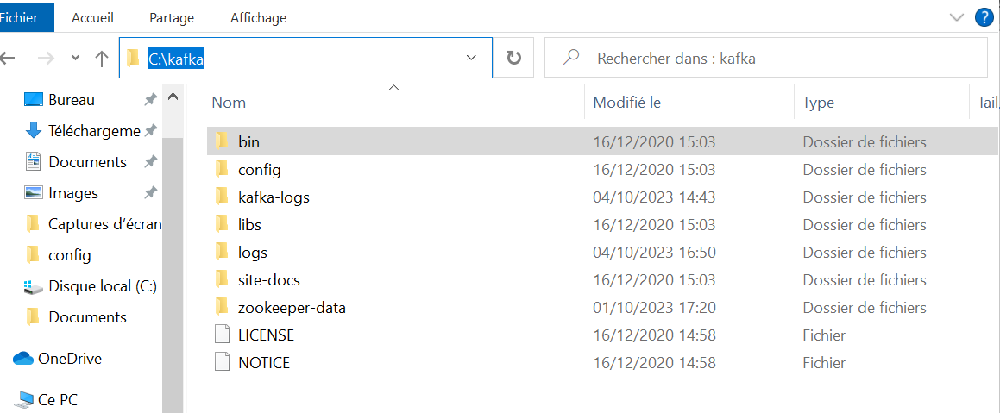
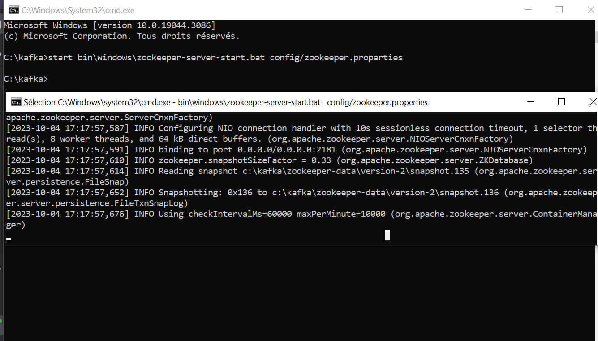
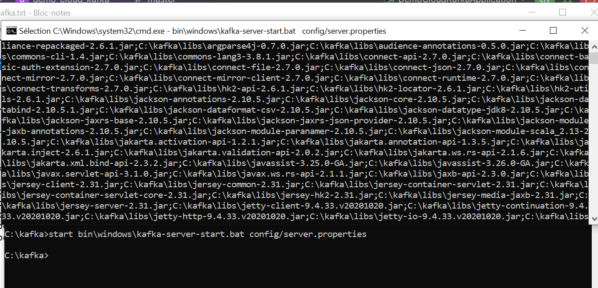
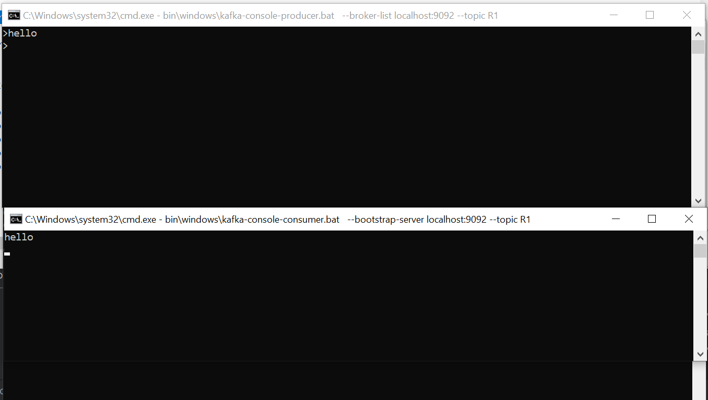
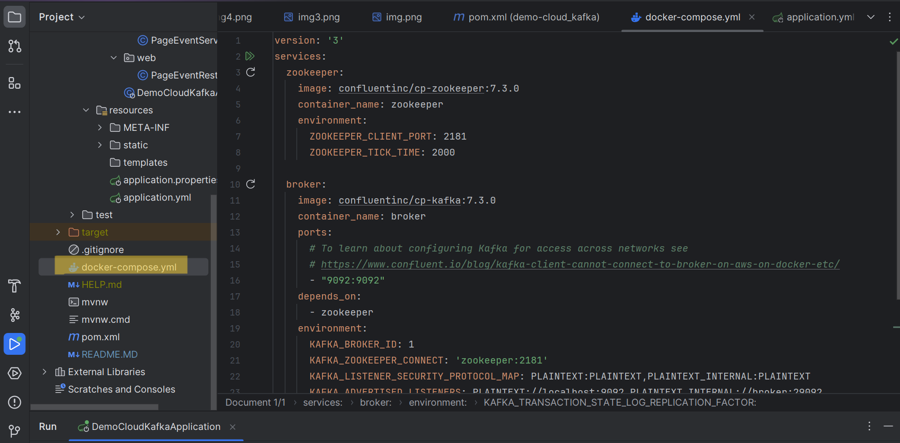
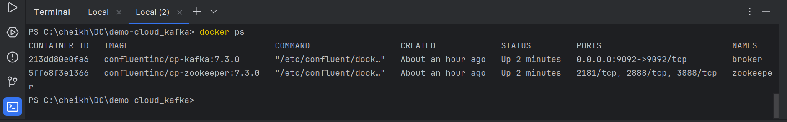
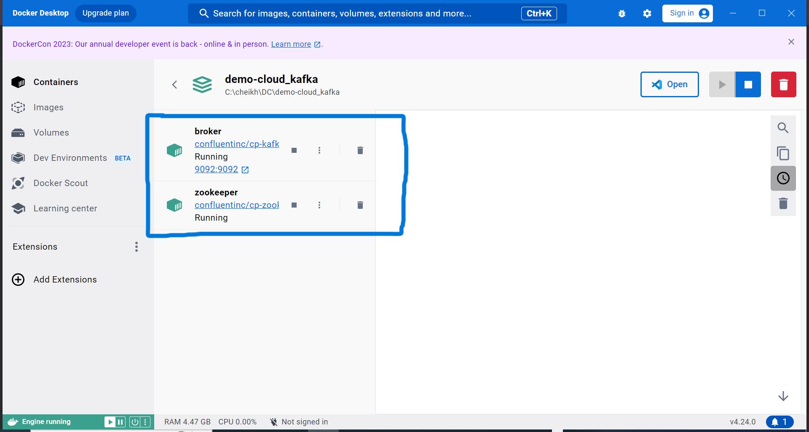
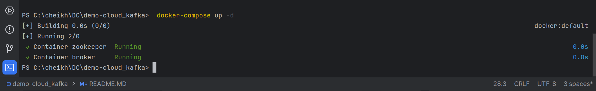
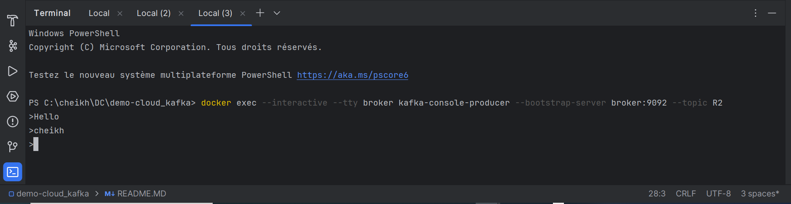
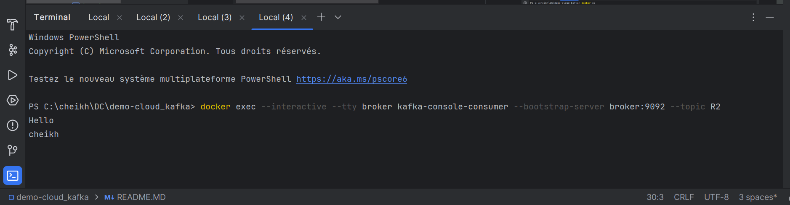

  
<h2></h2>
<h1>compte rendu</h1>
<h1>Beidja Cheikh</h1>
<h1>Master SDIA2</h1>

1.
- Télécharger Kafka  
-   

- Démarrer Zookeeper   
-   

- Démarrer Kafka-server  
-   

- Tester avec Kafka-console-producer et kafka-console-consumer   
-   

2. Avec Docker (voir https://developer.confluent.io/quickstart/kafka-docker/)
   https://www.youtube.com/watch?v=9O1Kuk2xXO8   
- Créer le fichier docker-compose.yml  
-   
- Démarrer les conteneurs docker : zookeeper et kafka-broker  
-  
- 
-   
- Tester avec Kafka-console-producer et kafka-console-consumer  
- Kafka-console-producer
-   
- kafka-console-consumer
-   
